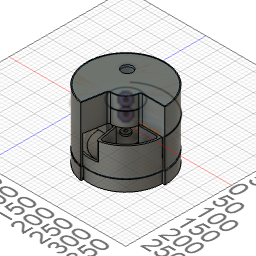
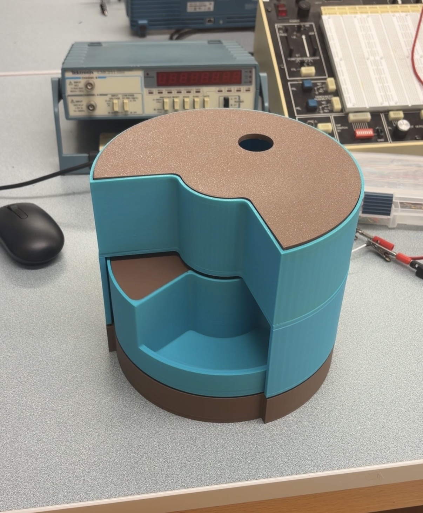
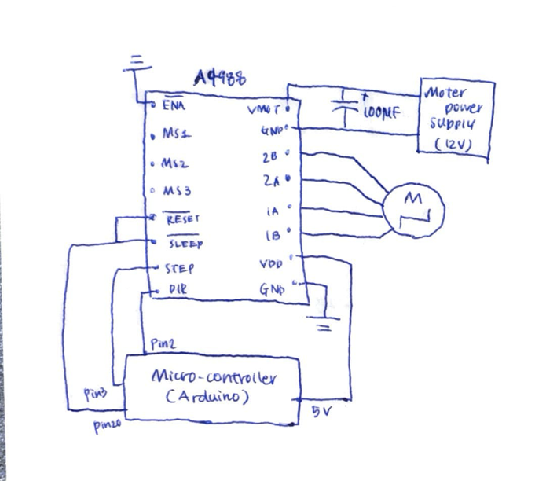

# 🐾 Smart Automated Pet Feeder

An IoT-based automated pet feeding system that combines **mechanical design**, **embedded electronics**, and **web software**. The feeder dispenses food at scheduled times using a NEMA 17 stepper motor controlled by an Arduino and A4988 driver. Feeding schedules are managed through a Django web application.

---

## 📸 Project Images

### CAD Design



### Final Prototype



### Electronics and Wiring



---

## ✨ Features

- Automated feeding schedule
- Django-based web interface
- Arduino-controlled stepper motor system
- A4988 microstepping driver (1/16 microstep mode)
- 3D-printed feeder assembly
- USB serial communication between Django and Arduino
- Sleep-mode power management to reduce motor heating
- Adjustable feeding times stored in a database

---

## ⚙️ System Architecture

```text
Django Scheduler
        │
        │ USB Serial
        ▼
    Arduino Mega
        │
        ▼
   A4988 Driver
        │
        ▼
 NEMA 17 Stepper Motor
        │
        ▼
 Rotating Food Dish
```

---

## 🛠 Hardware Components

| Component | Description |
|------------|------------|
| NEMA 17 (42HS28-1704A) | Stepper Motor |
| A4988 | Microstepping Motor Driver |
| Arduino Mega 2560 | Main Controller |
| 12V Power Supply | Motor Power |
| 100 µF Capacitor | VMOT Protection |
| PLA Printed Parts | Feeder Assembly |

---

## 💻 Software Stack

- Python
- Django
- SQLite
- Arduino IDE
- Fusion 360
- Serial Communication (PySerial)

---

## 🚀 Running the Django Application

```bash
git clone https://github.com/yourusername/pet-feeder.git

cd django_app

python -m venv .venv

source .venv/bin/activate
# Windows:
# .venv\Scripts\activate

pip install -r requirements.txt

python manage.py migrate

python manage.py runserver
```

---

## 🔌 Arduino Communication Protocol

The Django scheduler sends:

```text
FEED
```

The Arduino executes a 180° rotation and returns:

```text
DONE
```

The scheduler then marks the feeding event as completed.

---

## 📚 References

- Allegro MicroSystems A4988 Datasheet
- Handson Technology A4988 User Manual
- Rachel De Barros, "Control a NEMA 17 Stepper Motor with A4988 Driver and Arduino"

---

## 👤 Author

**Shinon Takei**

Physics Major, Grinnell College

PHY-397 Senior Project (2026)
